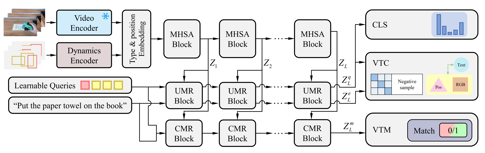

# OO-VLM

This repo is the official implementation of "OO-VLM: An Object-Oriented Video-Language Model for Egocentric Action Recognition".

## Update

**[2/17/2025]**
Code have been released!

## Introduction


In OO-VLM, we introduce an object-oriented videolanguage model (OO-VLM) for egocentric action recognition.
This model explicitly structures vision-language reasoning around
objects as fundamental units, leveraging object-centric learning
paradigms. Specifically, we use graph neural networks followed
by spatiotemporal transformers as dynamic encoders to model
object positions and their relationships with the hands. A pretrained video encoder is employed to extract appearance features.
To enable effective multimodal learning, we integrate two key
components: a uni-modal refinement (UMR) block that extracts
hand-object interaction features, and a cross-modal refinement
(CMR) block that focuses on multimodal video-text representations through object-adapted attention layers. During training,
we jointly optimize the proposed OO-VLM with three objectives:
a video classification loss, a matching loss for video-text pairs, and
a contrastive loss for pair similarity. These objectives allow the
model to effectively distinguish fine-grained actions in egocentric
videos. We evaluate the proposed OO-VLM on two popular
egocentric action recognition datasets: Something-SomethingV2 and EPIC-KITCHENS-100. Our experiments show that
the proposed approach consistently outperforms state-of-the-art
methods, particularly for actions that primarily rely on object
positions and motions.

## Model Zoo

All the models can be found in [MODEL_ZOO](MODEL_ZOO.md).

## Install

Please follow the installation instructions in [INSTALL](INSTALL.md).

## Data Preparation

You can find the dataset instructions in [DATASET](DATASET.md). We provide all the metadata files of our data.

## Testing

For testing, you can simply run the testing script in `exp` as follows:
```shell
source ./source exp/data_record/videomaev2_giant/test.sh
```
Before running the test, make sure to properly configure the parameters of the script.

[//]: # (##  Cite OO-VLM)

[//]: # ()
[//]: # (If you find this repository useful, please use the following BibTeX entry for citation.)

[//]: # ()
[//]: # (```latex)

[//]: # ()
[//]: # (```)

## License

This project is released under the MIT license. Please see the [LICENSE](LICENSE) file for more information.

## Acknowledgement

This repository is built based on [UniFormerV2](https://github.com/OpenGVLab/UniFormerV2) and [SlowFast](https://github.com/facebookresearch/SlowFast) repository.
